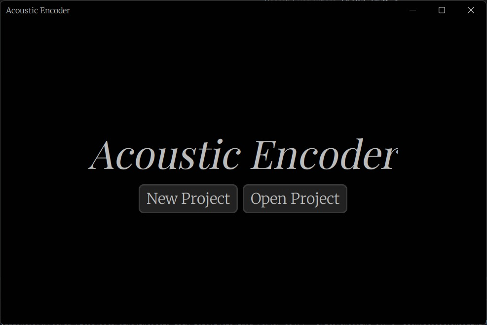
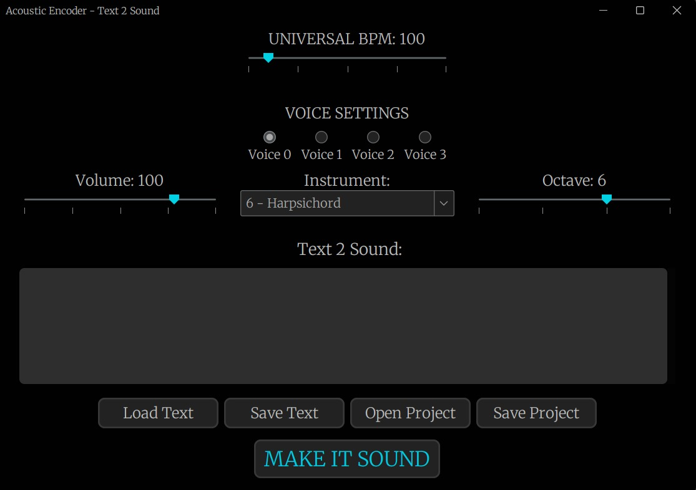
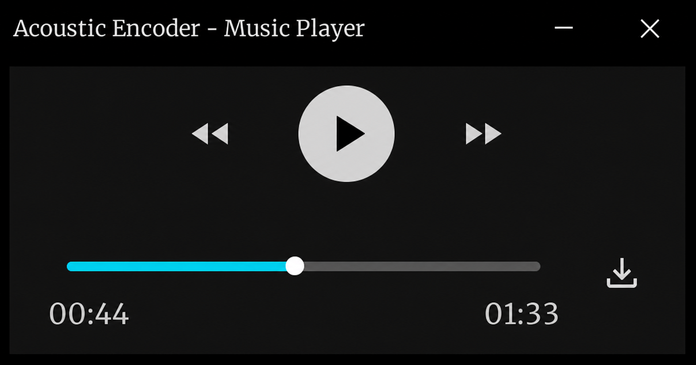

# Acoustic Encoder

A desktop application that turns text into MIDI music. Each character is interpreted as a musical instruction, while each line of text represents a separate voice. The result can be played, controlled, and exported as a `.mid` file.

> Developed for the Software Development course at UFRGS, with a focus on object-oriented programming, layered architecture, event-driven communication, and automated testing.

## Screenshots

### Start Screen

Create a new composition or continue working on a saved project.



### Text-to-Sound Editor

Write or import text, configure each voice, adjust the tempo, and convert the result into music.



### Music Player

Listen to the generated composition, navigate through it, and export it as a MIDI file.



## Features

- Converts text into MIDI notes and commands
- Supports multiple voices, with one voice per line of text
- Provides independent instrument, octave, and volume settings for each voice
- Allows users to control the composition's BPM
- Includes playback, pause, forward, rewind, and track navigation controls
- Imports and saves text files and projects
- Exports compositions as `.mid` files
- Provides a responsive desktop interface built with Java Swing and FlatLaf
- Uses configurable `.properties` files for character mappings

## How the Conversion Works

The encoder reads the text and converts each token into a musical instruction. Characters without a specific rule repeat the previously played note. The default mappings include:

| Input | Result |
| --- | --- |
| `A` to `H` | Plays a musical note |
| `a` to `h` | Adds silence |
| Space | Multiplies the volume |
| `?` or `.` | Raises the octave |
| `V` | Lowers the octave |
| `>` or `<` | Increases or decreases the local BPM |
| Digits and other symbols | Change or offset the instrument |
| Any other character | Repeats the previous note |

Each line is converted into a separate voice. When the input contains more lines than available voice configurations, the application reuses the configurations in round-robin order. See [`defaultEncoderMapping.properties`](src/main/resources/encoderMapping/defaultEncoderMapping.properties) for the complete mapping.

## Tech Stack

- Java 25
- Java Swing and Java Sound/MIDI
- FlatLaf 3.2.5
- Maven
- JUnit 5
- Mockito

## Architecture

The codebase separates business rules, use cases, and external implementation details:

```text
src/main/java/com/acoustic/encoder/
├── domain/          # Entities, value objects, and domain events
├── features/        # Conversion, start screen, and player features
├── infrastructure/  # MIDI, file access, event bus, and Swing components
└── main/            # Dependency composition and screen navigation
```

Features depend on ports such as `AudioPlayer`, `MusicExporter`, and `TextRepository`, while their concrete implementations remain in the infrastructure layer. An event bus decouples navigation and communication between screens.

## Requirements

- JDK 25
- Apache Maven 3.9 or later
- An audio device with MIDI support

Verify your installation:

```bash
java --version
mvn --version
```

## Running the Project

Clone the repository:

```bash
git clone https://github.com/lobos-l/Software-Development-Course.git
cd Software-Development-Course
```

### IntelliJ IDEA

1. Open the project directory and wait for Maven to import the dependencies.
2. Set the Project SDK to Java 25.
3. Run `com.acoustic.encoder.main.Main`.
4. If FlatLaf requests native access, add the following VM option to the run configuration:

```text
--enable-native-access=ALL-UNNAMED
```

### Terminal

Compile the project and copy its dependencies into the build directory:

```bash
mvn clean compile dependency:copy-dependencies
```

On macOS or Linux, run:

```bash
java --enable-native-access=ALL-UNNAMED \
  -cp "target/classes:target/dependency/*" \
  com.acoustic.encoder.main.Main
```

On Windows, replace `:` with `;` in the classpath.

## Tests

The project includes unit tests for value objects, voices, and the instruction parser. Run the test suite with:

```bash
mvn test
```

## Configuration

The main configuration files are located in `src/main/resources`:

- `defaultMusicProject.properties`: default BPM and voice parameters
- `encoderMapping/defaultEncoderMapping.properties`: token-to-command mappings
- `*ViewMapping.properties`: labels, dimensions, and other screen properties
- `themes/`: FlatLaf visual customizations

These files make it possible to change important parts of the application's behavior and appearance without modifying the domain rules.

## Roadmap

- Distribute standalone packages for Windows, macOS, and Linux
- Add continuous integration for builds and tests
- Increase test coverage for services, MIDI adapters, and UI flows
- Include sample compositions and a video demonstration
- Allow users to create and save custom conversion mappings through the interface

## Academic Context

This repository was created as a project for the Software Development course at UFRGS. It demonstrates the practical application of object-oriented programming, SOLID principles, dependency inversion, event-driven architecture, reusable UI components, and unit testing.
